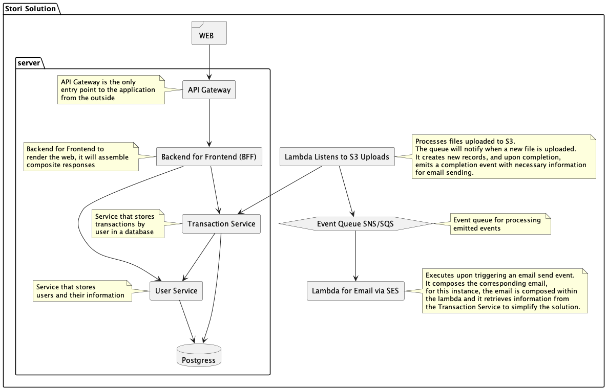

# CHALLENGE STORI

 Welcome to the [Project Name] README. This document provides an overview of the entire project, including how to set it up, run it, and the technologies it uses.

## Technology Stack
  This project leverages a modern stack of technologies to ensure a scalable, efficient, and robust application.

- Golang: The primary programming language used for writing the service due to its performance and simplicity.
- Docker: Utilized for containerizing the application and its services, ensuring consistency across different environments.
- LocalStack: A fully functional local cloud stack that simulates the AWS cloud environment on your local machine for development and testing purposes.
- Terraform: An infrastructure as code software tool that provides a consistent CLI workflow to manage hundreds of cloud services.Terraform codifies cloud APIs into declarative configuration files.

## Requirements

To run this project, you'll need to have the following tools installed:

- Docker: An open platform for developing, shipping, and running applications in containers.
- Docker-compose: A tool for defining and running multi-container Docker applications.
- Terraform: Infrastructure as code tool for building, changing, and versioning infrastructure safely and efficiently.
- AWS CLI: The Amazon Web Services Command Line Interface is a unified tool to manage AWS services.

## Getting Started

Follow the instructions in the sections below to get the project up and running on your local machine for development and testing purposes.

- User Service Setup
  Refer to the User Service README for instructions on setting up the user service.

- General Setup
  Based on the Makefile provided earlier, here are the generalized steps to get started:

1. Clone the repository to your local machine.
2. Navigate to the project's root directory in your terminal.
3. Run make createdb to create the PostgreSQL database.
4. Run make migrate to apply database migrations.
5. Run make generate to generate any necessary files.
6. Run make test to run the automated tests.
7. Run make run to start the service.

Detailed instructions for each of these steps can be found in the Getting Started Guide.

## Architecture
 The architecture of the project is detailed in the [Architecture README](./documentation/Architecture.md). This includes information about the hexagonal architecture pattern used and the project's folder structure.



## Running the Project

Follow these steps to get the project up and running on your local machine.

### Initial Setup

1. **Set User Seed Data (Optional)**:
   
  If you wish to modify the initial user data, you can update the seed file located at:
```
backend/database/V2_seed_user
```
Customize this file with the user data you want to seed the database with.

2. **Run the Application**:

To start the services, navigate to the root of the project directory and execute:
```
./run.sh
```

### Backend Configuration

The first time you set up the project, or when you need to update the database schemas, follow these steps:

1. **Run Migrations**:

In the backend service directories, execute the following command to run database migrations:
```
make migrate
```

2. **Generate Additional Code**:

If there is a need to generate additional code (like mock services or ORM code), use:
```
make generate
```

### Uploading a File for Processing

To upload a file to the simulated S3 bucket for processing:

1. **AWS CLI Configuration**:

Ensure you have AWS CLI installed and properly configured to interact with LocalStack. Update your AWS CLI configuration to use the LocalStack endpoint by running:
```
aws configure
```
and set the default region to `us-east-1` and account_id `test` secret_key `test` and output format to `json`.

2. **Upload the File**:

Execute the following command to upload `example.csv` to the designated S3 bucket:
```
aws s3 cp ./example.csv s3://stori-bucket --region us-east-1 --endpoint-url=http://s3.localhost.localstack.cloud:4566
```

After completing these steps, your file should be uploaded to the local S3 bucket and processed accordingly by the system.
Make sure to provide the correct relative path to the run.sh script and the seed file as per your project's structure. Replace "backend/database/V2_seed_user" with the actual path if it's different